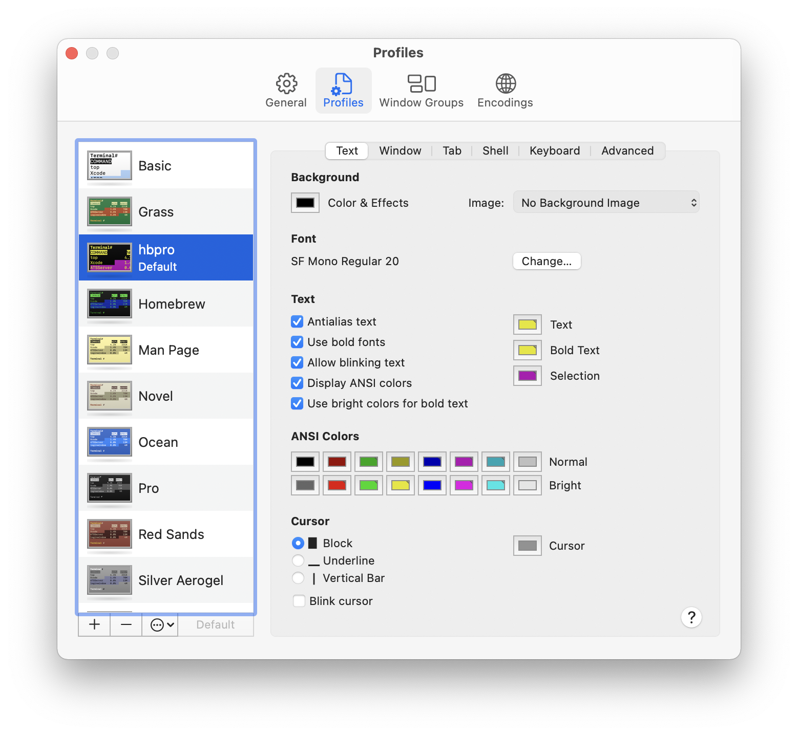

# dotfiles

`cterdam`'s personal computing environment setup for Unix-like (Mac) systems.

## Installing

- First setup the terminal.

  
  
<p align="center">
  
</p>

- In the Mac terminal, type `git` to trigger downloading developer tools.

## Submodules

This repo uses the git feature called submodules. This means you can embed
other git repoes inside this one. For example, I use
[sindresorhus/github-markdown-css][1] to enable previewing markdown in the
Github style. This is incorporated as a submodule.

[1]:
https://github.com/sindresorhus/github-markdown-css

If submodule folders appear empty after cloning, run this to download all
submodules (and their submodules, if any):

```zsh
git submodule update --init --recursive
```

Note that updating the parent repo will not automatically update submodules.
To update submodules, since git 1.8.2 the option `--remote` was added to
support updating to latest tips of remote branches:

```zsh
git submodule update --recursive --remote
```

Or, if cloning this parent repo for the first time, run this to ensure you
download everything:

```zsh
git clone --recursive <project url>
```
